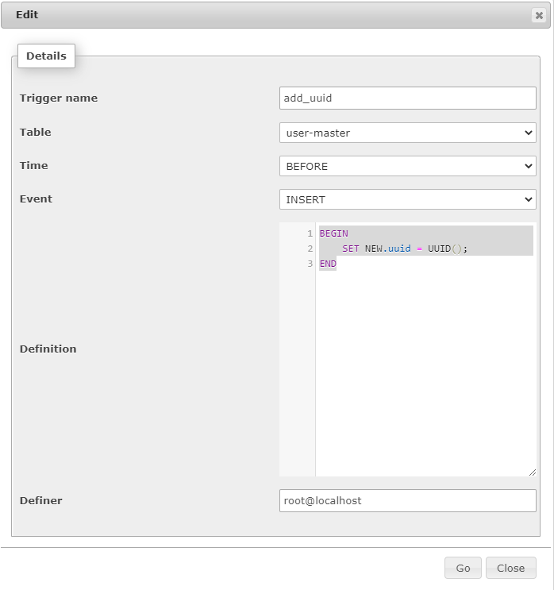

# Database and Table creation

## user-master table

```SQL
CREATE TABLE `user-master` (
  `uuid` varchar(36) NOT NULL,
  `email` varchar(255) NOT NULL,
  `password_hash` varchar(64) NOT NULL,
  PRIMARY KEY (`uuid`)
) ENGINE=InnoDB DEFAULT CHARSET=utf8mb4
```
### Trigger for user-master table
 Refer the screen shot below



```SQL
BEGIN 
    SET NEW.uuid = UUID(); 
END
```
## user_medical table

```SQL
CREATE TABLE `user_medical` (
  `uuid` varchar(36) NOT NULL,
  `dominant_eye` varchar(6) NOT NULL,
  `periphery_stimulant` varchar(3) NOT NULL,
  `control_pictures` varchar(3) NOT NULL,
  `background` varchar(3) NOT NULL,
  `object_distance` int(4) NOT NULL,
  `object_size` varchar(6) NOT NULL
) ENGINE=InnoDB DEFAULT CHARSET=utf8mb4
```

## user_personal_details table

```SQL
CREATE TABLE `user_personal_details` (
  `name` varchar(255) NOT NULL,
  `gender` varchar(6) NOT NULL,
  `address` text NOT NULL,
  `phone` int(10) NOT NULL,
  `zip` int(6) NOT NULL,
  `dob` date NOT NULL,
  `uuid` varchar(36) NOT NULL
) ENGINE=InnoDB DEFAULT CHARSET=utf8mb4
```